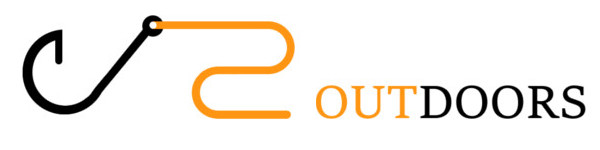

  

      

        

          <!--  -->
          
Welcome to JS-Outdoors. Hunting and Fishing stories written for and by the Midwestern Outdoorsman. If you have a passion for the outdoors too, then check out some of my most recent adventures below!

          <a class="btn" target="_blank" href="#instagram">Follow Along</a>
          <a class="btn btn-accent" href="#posts">View Posts</a>
        

      

  

  <h1><a href="{{ domain }}/blog.html">Recent Posts</a></h1>
    

      
          
      
    

  

      
  

  

  

